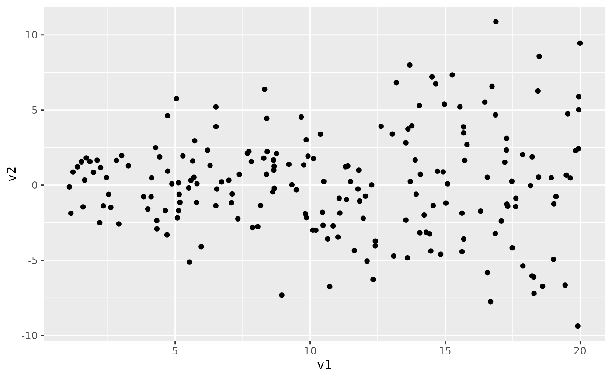
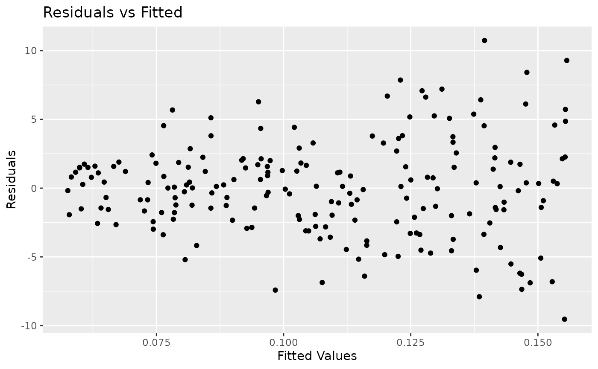
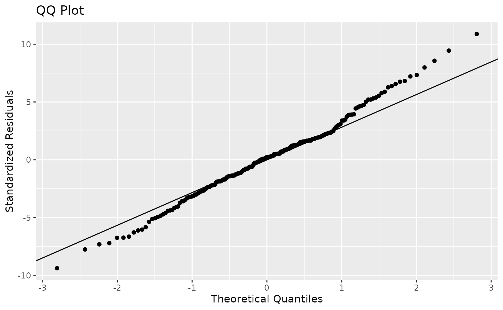
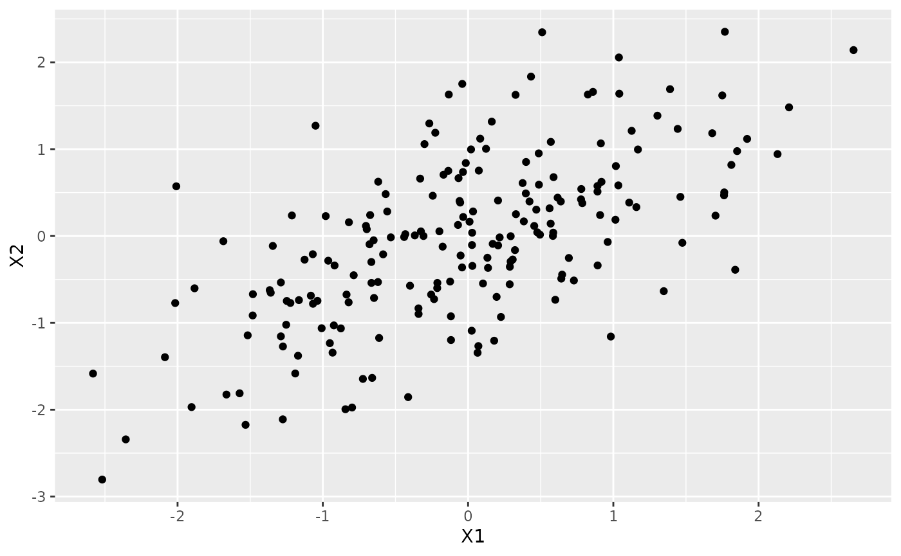
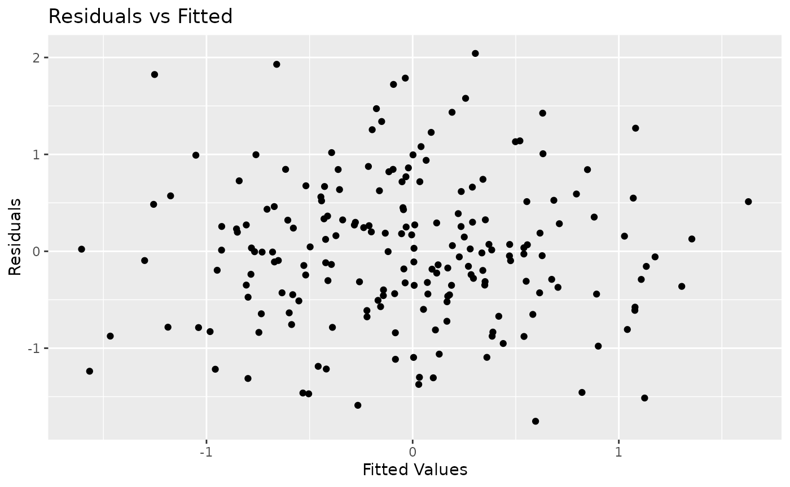
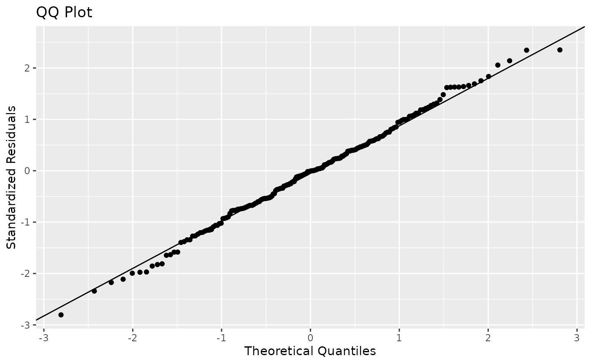

# Teaching About Unequal Variances

``` r

# library(edsamplr)
# library(tidyverse)
# library(ggplot2)
# library(gt)
```

While it is nice to use real research to demonstrate concepts for
students, not all concepts are found in published articles. For
instance, you may want to teach your students about what happens when we
do not meet conditions for valid inference. In an introductory
statistics class, you are introducing students to these conditions,
possibly for the first time. I am sure you try to impress on them the
importance of meeting the conditions, but it can be beneficial to show
the consequences of not meeting them.

For example, you might want to teach about not having equal variances.
For this, we can use two edsamplr functions:
[`generate_heteroscedastic()`](https://keahtandon.github.io/edsamplr/reference/generate_heteroscedastic.md)
and
[`generate_correlated()`](https://keahtandon.github.io/edsamplr/reference/generate_correlated.md).
For the first set of data with unequal variances, you can simulate data
with your preferred degree of heteroscedasticity. I picked a very high
degree for this example because I remember needing that extreme view
when I was an introductory statistics student.

``` r


unequal_var_data <- generate_heteroscedastic(n = 200, degree = 4)
```

For this sample, I selected a sample size of 200. Here are the summary
statistics for both variables and a scatterplot.

``` r


unequal_var_data %>%
  pivot_longer(everything(), names_to = "Variable", values_to = "Value") %>%
  group_by(Variable) %>%
  summarize(min = round(min(Value),2),
            q1 = round(quantile(Value, 0.25),2),
            median = round(median(Value),2),
            q3 = round(quantile(Value, 0.75),2),
            max = round(max(Value),2),
            mean = round(mean(Value),2),
            sd = round(sd(Value),2)) %>%
  gt(rowname_col = "Variable")
```

|     | min   | q1    | median | q3    | max   | mean  | sd   |
|-----|-------|-------|--------|-------|-------|-------|------|
| v1  | 1.09  | 5.93  | 10.94  | 15.62 | 19.99 | 10.85 | 5.48 |
| v2  | -9.38 | -1.92 | 0.23   | 1.90  | 10.88 | 0.11  | 3.46 |

``` r


unequal_var_data %>%
  ggplot(aes(x = v1, y = v2)) +
  geom_point()
```



I then did a simple linear regression and plotted the residual-fit plot
and the QQ plot. You can see the clearly see the heteroscedasticity.

``` r


unequal_var_model <- lm(v2 ~ v1, data = unequal_var_data)
summary(unequal_var_model)
#> 
#> Call:
#> lm(formula = v2 ~ v1, data = unequal_var_data)
#> 
#> Residuals:
#>     Min      1Q  Median      3Q     Max 
#> -9.5345 -2.0305  0.1157  1.8121 10.7423 
#> 
#> Coefficients:
#>             Estimate Std. Error t value Pr(>|t|)
#> (Intercept) 0.051946   0.544605   0.095    0.924
#> v1          0.005189   0.044815   0.116    0.908
#> 
#> Residual standard error: 3.467 on 198 degrees of freedom
#> Multiple R-squared:  6.77e-05,   Adjusted R-squared:  -0.004982 
#> F-statistic: 0.0134 on 1 and 198 DF,  p-value: 0.9079

unequal_var_model %>%
  ggplot(aes(x = .fitted, y = .resid)) +
  geom_point() +
  labs(title = "Residuals vs Fitted",
       x = "Fitted Values",
       y = "Residuals")
#> Warning: `fortify(<lm>)` was deprecated in ggplot2 4.0.0.
#> ℹ Please use `broom::augment(<lm>)` instead.
#> ℹ The deprecated feature was likely used in the ggplot2 package.
#>   Please report the issue at <https://github.com/tidyverse/ggplot2/issues>.
#> This warning is displayed once per session.
#> Call `lifecycle::last_lifecycle_warnings()` to see where this warning was
#> generated.
```



``` r


unequal_var_model %>%
  ggplot(aes(sample = v2)) +
  stat_qq() +
  stat_qq_line() +
  labs(title = "QQ Plot",
       x = "Theoretical Quantiles",
       y = "Standardized Residuals")
```



  

In comparison, we have another sample with equal variances. I have
replicated everything from above except that I used the
[`generate_correlated()`](https://keahtandon.github.io/edsamplr/reference/generate_correlated.md)
function.

``` r


equal_var_data <- generate_correlated(n = 200, r = 0.67, 
                                      slope = 0.7, summary = FALSE)

equal_var_data %>%
  pivot_longer(everything(), names_to = "Variable", values_to = "Value") %>%
  group_by(Variable) %>%
  summarize(min = round(min(Value),2),
            q1 = round(quantile(Value, 0.25),2),
            median = round(median(Value),2),
            q3 = round(quantile(Value, 0.75),2),
            max = round(max(Value),2),
            mean = round(mean(Value),2),
            sd = round(sd(Value),2)) %>%
  gt(rowname_col = "Variable")
```

|     | min   | q1    | median | q3   | max  | mean  | sd   |
|-----|-------|-------|--------|------|------|-------|------|
| X1  | -2.58 | -0.71 | -0.03  | 0.58 | 2.65 | -0.05 | 0.99 |
| X2  | -2.80 | -0.67 | -0.01  | 0.57 | 2.35 | -0.04 | 0.96 |

``` r


equal_var_data %>%
  ggplot(aes(x = X1, y = X2)) +
  geom_point()
```



``` r


equal_var_model <- lm(X2 ~ X1, data = equal_var_data)
summary(equal_var_model)
#> 
#> Call:
#> lm(formula = X2 ~ X1, data = equal_var_data)
#> 
#> Residuals:
#>      Min       1Q   Median       3Q      Max 
#> -1.75412 -0.45148 -0.00787  0.45295  2.04176 
#> 
#> Coefficients:
#>             Estimate Std. Error t value Pr(>|t|)    
#> (Intercept) -0.01088    0.05285  -0.206    0.837    
#> X1           0.61776    0.05362  11.520   <2e-16 ***
#> ---
#> Signif. codes:  0 '***' 0.001 '**' 0.01 '*' 0.05 '.' 0.1 ' ' 1
#> 
#> Residual standard error: 0.7464 on 198 degrees of freedom
#> Multiple R-squared:  0.4013, Adjusted R-squared:  0.3983 
#> F-statistic: 132.7 on 1 and 198 DF,  p-value: < 2.2e-16

equal_var_model %>%
  ggplot(aes(x = .fitted, y = .resid)) +
  geom_point() +
  labs(title = "Residuals vs Fitted",
       x = "Fitted Values",
       y = "Residuals")
```



``` r


equal_var_model %>%
  ggplot(aes(sample = X2)) +
  stat_qq() +
  stat_qq_line() +
  labs(title = "QQ Plot",
       x = "Theoretical Quantiles",
       y = "Standardized Residuals")
```



You (or your students!) can replicate this simulation or change up the
values in the arguments to test different scenarios. You can also have
them plug in various values of X to see how accurate the models’
predictions are.
